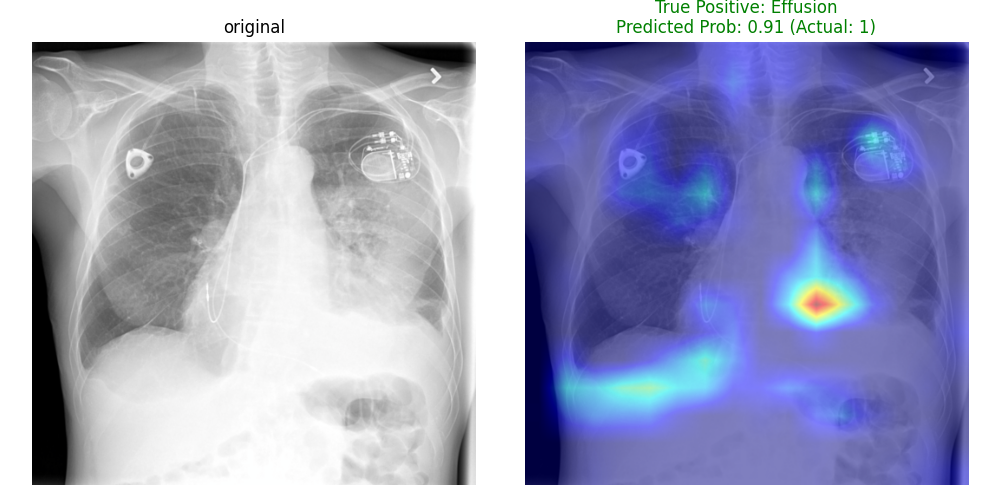
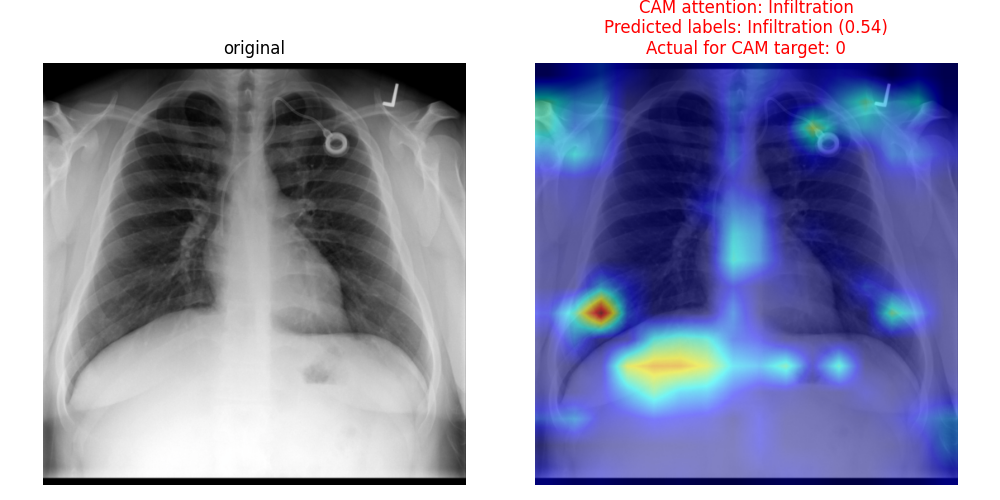

# 🩺 Chest X-Ray Multi-Label Classification


 
 

[](https://www.codefactor.io/repository/github/hira0mi/medvision-chest-classification)

This repository contains a robust Deep Learning pipeline for the multi-label classification of chest X-ray images. The model is engineered to detect 5 core thoracic pathologies from the NIH Chest X-ray dataset: **Consolidation, Effusion, Cardiomegaly, Atelectasis, and Infiltration**.

Beyond standard model training, this project emphasizes **medical data integrity, custom computer vision preprocessing, handling extreme class imbalance, and Explainable AI (XAI)** to ensure clinical relevance.

---

## 📊 Performance & Relation to SOTA

While landmark papers in this domain (e.g., **CheXNet**, Rajpurkar et al., 2017) evaluate on 14 different pathologies using massive model ensembles, this project focuses on a core subset of 5 findings using a single lightweight architecture. 

Direct comparison across different label spaces is inherently nuanced. However, comparing the F1-scores on these specific pathologies demonstrates that our model achieves **near-expert level feature extraction capabilities**, lagging behind SOTA baselines by only `~0.02` in Macro F1-score.

| Pathology (Class) | Our F1-Score | SOTA / CheXNet Benchmark (Approx.)* |
| :--- | :---: | :---: |
| **Effusion** | **0.50** | ~0.53 |
| **Infiltration** | **0.41** | ~0.43 |
| **Atelectasis** | **0.37** | ~0.39 |
| **Cardiomegaly** | **0.35** | ~0.38 |
| **Consolidation** | **0.23** | ~0.28 |
| **Macro Average** | **0.37** | **~0.40** |

*\*Note: SOTA values are approximate benchmarks derived from literature on the official NIH Dataset. Discrepancies may arise from different data splitting strategies. Our strict patient-level `GroupShuffleSplit` ensures **zero data leakage**, providing a highly realistic evaluation on unseen patients.*

### 🎯 Metric Optimization Philosophy (Recall > Precision)
As seen in our final Classification Report, the optimization of Precision-Recall thresholds successfully favored **Recall (Sensitivity)** over Precision across the board (e.g., **Recall of 0.61 vs Precision of 0.43 for Effusion**). 

This is the highly desired behavior for a primary medical screening tool:
*   **High Recall:** Minimizes life-threatening False Negatives (missing a sick patient).
*   **Lower Precision:** Results in more False Positives, which in a real-world clinical setting merely leads to a safe secondary review by a human radiologist.

**Global Metrics:**
*   **Weighted F1-Score:** `0.40`
*   **Global Average Recall:** `0.50`
*   **Hamming Loss:** `~0.14` *(Demonstrates the overall fraction of incorrect binary assignments across all 5 clinical labels)*

---

## ✨ Key Methodologies & Engineering

This project implements a medically-aware ML pipeline, actively avoiding "black-box" shortcuts:

### 1. Data Engineering & Preprocessing
*   **Patient-Aware Splitting:** Used `GroupShuffleSplit` on `Patient ID` to ensure that multiple scans from the same patient do not leak across training and validation sets.
*   **Custom Lung Cropping (`lung_cropping.py`):** An OpenCV-based pipeline using Gaussian Blur, Otsu's thresholding, and morphological operations to automatically detect the largest contours. This crops out irrelevant background (neck, arms, external artifacts) and forces the network to focus strictly on the thoracic cavity.
*   **Aspect-Ratio Preserving Padding:** Instead of blindly resizing images (which distorts heart size and pathology shapes), a custom `PadToSquare` transform pads the image with zeros before resizing to `512x512`.

### 2. Modeling & Loss Optimization
*   **Architectural Upgrade (ConvNeXt vs. DenseNet):** The original CheXNet paper utilized *DenseNet-121*, which was the gold standard in 2017. In this project, we modernized the backbone by adopting **ConvNeXt-Tiny** (2022). ConvNeXt introduces Vision Transformer (ViT) design principles into a pure CNN. For chest X-rays, ConvNeXt's use of **larger 7x7 depthwise convolutions** provides a much wider receptive field right from the early layers. This is crucial for identifying large-scale structural anomalies (like *Cardiomegaly*) and diffuse textures (like *Infiltration*), outperforming older architectures while maintaining a highly efficient parameter count.
*   **Focal Loss + Positional Weights:** To combat extreme class imbalance, dynamically calculated class frequencies are passed as `pos_weights` to a custom Focal Loss ($\gamma=2.0$). This forces the model to focus on hard-to-classify examples rather than being overwhelmed by healthy scans.
*   **PR-AUC Checkpointing:** Model checkpoints are evaluated and saved based on **PR-AUC (Mean Average Precision)** rather than ROC-AUC, providing a much more rigorous evaluation metric for highly imbalanced medical datasets.

### 3. MLOps: Optimal Threshold Baking
Instead of relying on a default `0.5` decision boundary, `evaluate.py` calculates the ideal operating point (Threshold) for *each individual class* by maximizing the F1-score on Precision-Recall curves. 
These optimized thresholds are **physically registered as PyTorch buffers (`register_buffer`)** directly into the `.pth` weights file. This ensures seamless deployment—the `predict()` method inherently knows the correct thresholds without requiring external config files.

---

## 🧠 Interpretability & Error Analysis (Grad-CAM)

To ensure the model relies on actual anatomical features rather than dataset shortcuts, **Grad-CAM** was integrated to visualize the network's attention maps.

### ✅ True Positive: Learning Actual Pathology
When predicting distinct pathologies like **Effusion** (fluid in the pleural cavity), XAI confirms that the model correctly focuses on the relevant anatomical regions (e.g., the lower lobes and costophrenic angles).

<p align="center">
  
</p>

### ❌ False Positive: Medical Artifact Bias
Crucially, XAI also helps identify data biases. In the example below, the model hallucinates an **Infiltration**, resulting in a False Positive. Grad-CAM reveals that the network is heavily attending to the **chest tubes/catheters**. The model falsely learned that the presence of intensive care equipment correlates strongly with severe disease—a classic bias in medical ML datasets that requires careful attention.

<p align="center">
  
</p>

*(True Positive image generated using `generate_cams.py`)*

---

## 📁 Project Structure

```text
├── src/
│   ├── model.py            # ConvNeXt architecture & threshold buffering
│   ├── train.py            # Training loop, Focal Loss, AMP, TensorBoard logging
│   ├── evaluate.py         # PR-curve threshold optimization
│   ├── dataset.py          # Custom PyTorch Dataset class
│   ├── prepare_data.py     # NIH data downloading and Patient-aware splitting
│   ├── lung_cropping.py    # OpenCV automated lung bounding-box cropping
│   ├── metrics.py          # Comprehensive multi-label metrics calculation
│   └── generate_cams.py    # XAI script for extracting & visualizing attention maps
├── showcase_images/        # Grad-CAM visualization examples
└── README.me
```

## 🚀 Quick Start

1. Clone the repository and install requirements
2. Download and prepare the dataset:

```bash
python prepare_data.py
```
3. Train the model:
```bash
python train.py
```
4. Evaluate the model, find optimal thresholds, and bake them into the weights:
```bash
python evaluate.py
```
5. Run Explainable AI analysis:
```bash
python generate_cams.py   
```
 ## 📚 References

1. **CheXNet:** Rajpurkar, P., et al. (2017). CheXNet: Radiologist-Level Pneumonia Detection on Chest X-Rays with Deep Learning. [arXiv:1711.05225](https://www.google.com/url?sa=E&q=https%3A%2F%2Farxiv.org%2Fabs%2F1711.05225)
    
2. **ConvNeXt:** Liu, Z., et al. (2022). A ConvNet for the 2020s. [CVPR 2022](https://www.google.com/url?sa=E&q=https%3A%2F%2Farxiv.org%2Fabs%2F2201.03545)
    
3. **Focal Loss:** Lin, T., et al. (2017). Focal Loss for Dense Object Detection. [ICCV 2017](https://www.google.com/url?sa=E&q=https%3A%2F%2Farxiv.org%2Fabs%2F1708.02002)
    
4. **Grad-CAM:** Selvaraju, R. R., et al. (2017). Grad-CAM: Visual Explanations from Deep Networks via Gradient-based Localization. [ICCV 2017](https://www.google.com/url?sa=E&q=https%3A%2F%2Farxiv.org%2Fabs%2F1610.02391)
    
5. **Dataset:** NIH Chest X-ray Dataset of 112,120 X-ray images with disease labels.
